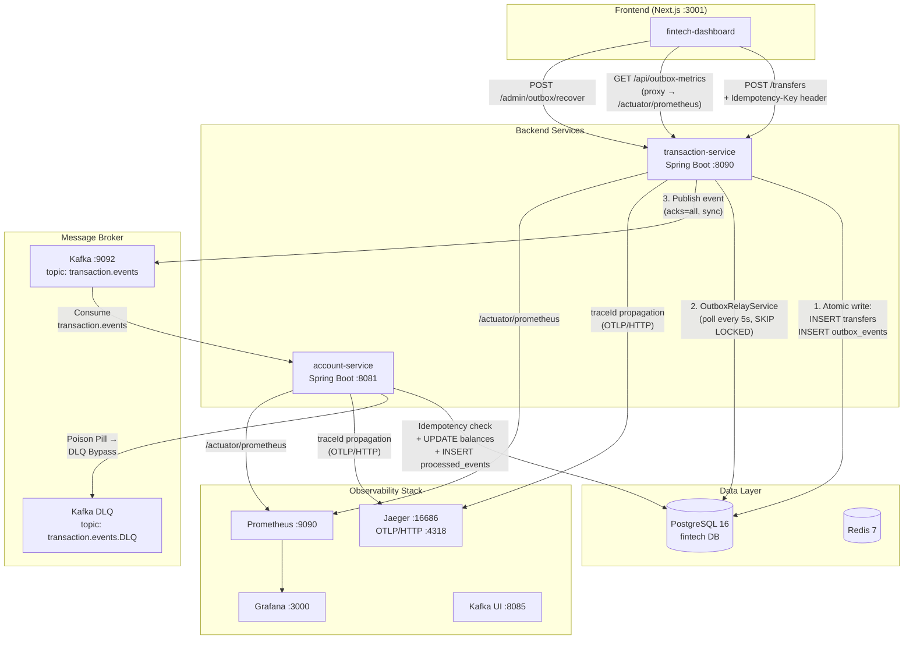

# Fintech MVP — Event-Driven Architecture & Resiliency

> Um ecossistema de microsserviços financeiros construído com foco em **alta disponibilidade**, **consistência eventual** e **resiliência operacional**. Cada decisão de engenharia foi tomada para garantir que nenhuma transação seja perdida, duplicada ou processe um payload corrompido — mesmo sob falha parcial de infraestrutura.

---

## Índice

- [Visão Geral](#visão-geral)
- [Topologia da Arquitetura](#topologia-da-arquitetura)
- [Mecanismos de Resiliência](#mecanismos-de-resiliência)
- [Stack Tecnológica](#stack-tecnológica)
- [Estrutura do Repositório](#estrutura-do-repositório)
- [Como Executar](#como-executar)
- [Portas e Acessos](#portas-e-acessos)
- [Testes de Integração](#testes-de-integração)
- [Alertas e Observabilidade](#alertas-e-observabilidade)

---

## Visão Geral

O **Fintech MVP** é um ecossistema de 10 containers orquestrado via Docker Compose, projetado para simular um ambiente de produção de pagamentos Pix. O sistema implementa o padrão **Transactional Outbox** para garantir atomicidade entre a escrita no banco de dados e a publicação de eventos no Kafka, uma **barreira de idempotência dupla** (produtor e consumidor) para eliminar duplicidade de saldo, e um pipeline de **Dead Letter Queue (DLQ)** para isolar mensagens corrompidas sem degradar o throughput do sistema.

A observabilidade é tratada como cidadã de primeira classe: cada requisição carrega um `traceId` propagado via **OpenTelemetry** até o **Jaeger**, enquanto métricas customizadas do Outbox são expostas ao **Prometheus** e visualizadas em dashboards do **Grafana** com alertas pré-configurados.

---

## Topologia da Arquitetura



### Fluxo de uma Transferência Pix

```
Usuário (Dashboard)
    │
    ├─ POST /transfers  { fromAccount, toAccount, amountCents }
    │   Header: Idempotency-Key: <uuid>
    │
    ▼
transaction-service
    ├─ [DB Transaction] ──────────────────────────────────────────┐
    │   INSERT INTO transfers (idempotency_key, status=PENDING)   │  ATOMIC
    │   INSERT INTO outbox_events (event_type='TransferCreated')  │
    └─────────────────────────────────────────────────────────────┘
    │
    ├─ OutboxRelayService (scheduler @5s)
    │   SELECT * FROM outbox_events WHERE status=PENDING
    │   FOR UPDATE SKIP LOCKED
    │   → kafka.send("transaction.events", event).get()  [sync, acks=all]
    │   → UPDATE outbox_events SET status=SENT
    │   → (on failure) exponential backoff: 2→4→8→16 min
    │   → (5 attempts) UPDATE status=DEAD_LETTER
    │
    ▼
Kafka topic: transaction.events
    │
    ▼
account-service (KafkaListener)
    ├─ existsById(eventId) → se já existe: SKIP (idempotência)
    ├─ UPDATE accounts SET balance = balance - amount WHERE id = fromAccount
    ├─ UPDATE accounts SET balance = balance + amount WHERE id = toAccount
    ├─ INSERT INTO processed_events (event_id)  [UNIQUE constraint]
    └─ (DeserializationException) → route to transaction.events.DLQ
```

---

## Mecanismos de Resiliência

### Transactional Outbox Pattern
A escrita da transferência e do evento de domínio ocorre em **uma única transação de banco de dados**. Se o Kafka estiver indisponível no momento da criação, o evento permanece na tabela `outbox_events` com status `PENDING` e será retransmitido pelo `OutboxRelayService` assim que o broker se recuperar. **Nenhuma transação é perdida por queda do broker.**

- Polling a cada **5 segundos** com `SELECT FOR UPDATE SKIP LOCKED` (sem contenção entre réplicas)
- Publicação **síncrona** (`producer.send().get()`) com `acks=all` para garantia de durabilidade
- Backoff exponencial: **2 → 4 → 8 → 16 minutos** entre tentativas
- Após **5 tentativas falhas**: status promovido para `DEAD_LETTER` + alerta Prometheus instantâneo

### Barreira de Idempotência Dupla

**Lado Produtor (transaction-service):**
- Header HTTP `Idempotency-Key` obrigatório (gerado como `crypto.randomUUID()` no dashboard)
- Coluna `transfers.idempotency_key` com `UNIQUE CONSTRAINT` no PostgreSQL
- Requisições duplicadas retornam o mesmo `transferId` sem inserir novo registro nem novo evento no Outbox

**Lado Consumidor (account-service):**
- Verificação prévia via `existsById(eventId)` antes de qualquer operação de saldo
- Coluna `processed_events.event_id` com `UNIQUE CONSTRAINT` como segunda linha de defesa
- Mensagem duplicada é **silenciosamente descartada** — saldo alterado exatamente uma vez

### ☠️ Poison Pill & DLQ Bypass
Mensagens com payload malformado (ex: JSON inválido, campos ausentes) disparam uma `DeserializationException` no consumidor. Em vez de travar a partição e bloquear mensagens válidas subsequentes, o `account-service` roteia automaticamente o payload corrompido para o tópico `transaction.events.DLQ`, liberando a CPU para continuar processando o fluxo principal.

- Tópico DLQ: `transaction.events.DLQ` (1 partição, replication factor 1)
- Dashboard exibe banner de alerta crítico animado quando `deadLetter > 0`
- Endpoint de recuperação manual: `POST /admin/outbox/recover`

### Tracing Distribuído (OpenTelemetry + Jaeger)
Cada requisição HTTP e cada mensagem Kafka carregam um `traceId` propagado via **W3C TraceContext**. O pipeline de instrumentação usa **Micrometer Tracing → OpenTelemetry SDK → Jaeger OTLP/HTTP** com **100% de sampling** em desenvolvimento.

- Visualização de spans end-to-end: `Dashboard → transaction-service → Kafka → account-service`
- Receptor OTLP/HTTP em `jaeger:4318`, OTLP/gRPC em `jaeger:4317`

### Métricas Customizadas (Prometheus + Grafana)
Três gauges customizados expostos via `/actuator/prometheus`:

| Métrica | Descrição |
|---|---|
| `outbox_pending_events` | Eventos aguardando publicação no Kafka |
| `outbox_sent_events` | Eventos publicados com sucesso |
| `outbox_dead_letter_events` | Eventos que esgotaram todas as tentativas |

---

## Stack Tecnológica

| Camada | Tecnologia | Versão |
|---|---|---|
| Frontend | Next.js + React + TypeScript + Tailwind CSS | 14.2.3 / 18 / 5 / 3.4 |
| Backend | Spring Boot + Java | 3.2.5 / 17 |
| Build | Maven | 3.9 |
| Banco de Dados | PostgreSQL | 16 |
| Cache | Redis | 7 |
| Message Broker | Confluent Kafka + ZooKeeper | 7.6.1 |
| Tracing | OpenTelemetry → Jaeger | 1.57 |
| Métricas | Micrometer → Prometheus → Grafana | latest |
| Kafka UI | Provectus Kafka UI | latest |
| Containerização | Docker + Docker Compose | — |
| Testes | Testcontainers + JUnit 5 + Awaitility | — |

---

## Estrutura do Repositório

```
fintech-mvp/
├── apps/
│   ├── fintech-dashboard/          # Frontend Next.js (porta 3001)
│   │   └── src/app/
│   │       ├── page.tsx            # Dashboard operacional (Pix, Outbox Health, DLQ Recovery)
│   │       ├── layout.tsx          # Layout global (dark theme, pt-BR)
│   │       └── api/outbox-metrics/ # API Route proxy → /actuator/prometheus
│   │
│   ├── transaction-service/        # Microsserviço de transferências (porta 8090)
│   │   └── src/main/java/
│   │       ├── controller/         # TransferController (POST /transfers, POST /admin/outbox/recover)
│   │       ├── service/            # PixTransferService, OutboxRelayService
│   │       ├── entity/             # Transfer, OutboxEvent
│   │       └── repository/         # TransferRepository, OutboxEventRepository
│   │
│   └── account-service/            # Microsserviço de contas/saldos (porta 8081)
│       └── src/main/java/
│           ├── consumer/           # AccountConsumer (KafkaListener)
│           ├── entity/             # Account, ProcessedEvent
│           └── repository/         # AccountRepository, ProcessedEventRepository
│
└── infra/
    ├── docker-compose.yml          # Orquestração dos 10 containers
    └── observability/
        ├── prometheus.yml          # Scrape configs (transaction-service, account-service)
        ├── prometheus.rules.yml    # Alertas: HighTransferErrorRate, JVMHeapHighUsage, OutboxDeadLetterEvent
        └── grafana/
            └── provisioning/       # Datasources e dashboards provisionados automaticamente
```

---

## Como Executar

### Pré-requisitos

- Docker Engine 24+ e Docker Compose v2
- Mínimo de **6 GB de RAM** disponível para o Docker
- Portas `3000`, `3001`, `5432`, `6379`, `8081`, `8085`, `8090`, `9090`, `9092`, `16686` livres

### 1. Clonar o repositório

```bash
git clone <url-do-repositorio>
cd fintech-mvp
```

### 2. Subir a infraestrutura base

```bash
cd infra
docker compose up -d postgres redis zookeeper kafka kafka-ui
```

> Aguarde o PostgreSQL passar no healthcheck antes de prosseguir:
> ```bash
> docker compose ps   # postgres deve exibir "(healthy)"
> ```

### 3. Subir o stack de observabilidade

```bash
docker compose up -d jaeger prometheus grafana
```

### 4. Build e deploy dos microsserviços

```bash
docker compose up -d --build transaction-service account-service
```

> O build Maven pode levar **2–4 minutos** na primeira execução (download de dependências).
> Acompanhe os logs:
> ```bash
> docker compose logs -f transaction-service account-service
> ```

### 5. Subir o frontend

```bash
cd ../apps/fintech-dashboard
npm install
npm run dev
```

> O dashboard estará disponível em `http://localhost:3001`

### Subir tudo de uma vez (após o primeiro build)

```bash
cd infra
docker compose up -d
```

### Parar o ecossistema

```bash
docker compose down          # mantém volumes (dados persistidos)
docker compose down -v       # remove volumes (reset completo)
```

---

## Portas e Acessos

| Serviço | URL | Credenciais |
|---|---|---|
| **Fintech Dashboard** (Next.js) | http://localhost:3001 | — |
| **Grafana** | http://localhost:3000 | `admin` / `admin` |
| **Jaeger UI** | http://localhost:16686 | — |
| **Prometheus** | http://localhost:9090 | — |
| **Kafka UI** | http://localhost:8085 | — |
| **transaction-service** API | http://localhost:8090 | — |
| **transaction-service** Health | http://localhost:8090/actuator/health | — |
| **transaction-service** Metrics | http://localhost:8090/actuator/prometheus | — |
| **account-service** API | http://localhost:8081 | — |
| **account-service** Health | http://localhost:8081/actuator/health | — |
| **PostgreSQL** | `localhost:5432` | `fintech_admin` / `fintech_pass` |
| **Redis** | `localhost:6379` | — |

### Endpoints principais da API

```bash
# Criar uma transferência Pix
curl -X POST http://localhost:8090/transfers \
  -H "Content-Type: application/json" \
  -H "Idempotency-Key: $(uuidgen)" \
  -d '{"fromAccount": "acc-001", "toAccount": "acc-002", "amountCents": 5000}'

# Verificar saúde do serviço
curl http://localhost:8090/actuator/health

# Recuperar eventos em Dead Letter manualmente
curl -X POST http://localhost:8090/admin/outbox/recover
```

---

## Testes de Integração

Os testes de integração usam **Testcontainers** para provisionar containers reais de PostgreSQL e Kafka durante a execução, garantindo fidelidade máxima ao ambiente de produção.

### Executar os testes

```bash
# transaction-service
cd apps/transaction-service
mvn verify -P integration-test

# account-service
cd apps/account-service
mvn verify -P integration-test
```

### Cenários cobertos

**`TransferControllerIT` (transaction-service):**
| Cenário | Asserção |
|---|---|
| Criar transferência válida | HTTP 201, `status=PENDING`, exatamente 1 linha em `outbox_events` com `event_type='TransferCreated'` |
| Requisição duplicada (mesmo `Idempotency-Key`) | Mesmo `transferId` retornado, **zero** novas linhas em `outbox_events` |

**`AccountConsumerIT` (account-service):**
| Cenário | Asserção |
|---|---|
| Evento válido consumido | `fromAccount` debitado, `toAccount` creditado, exatamente 1 linha em `processed_events` |
| Evento duplicado (`eventId` repetido) | Segunda mensagem descartada silenciosamente, saldos alterados **exatamente uma vez** |

> **Nota:** Ambas as suites usam `LinuxDockerApiStrategy` com API version `1.47` para compatibilidade com Docker 27+ / WSL2.

---

## Alertas e Observabilidade

Três alertas Prometheus pré-configurados em `infra/observability/prometheus.rules.yml`:

| Alerta | Condição | Severidade |
|---|---|---|
| `HighTransferErrorRate` | Taxa de erros 5xx > 5% por 2 minutos | `critical` |
| `JVMHeapHighUsage` | Uso de heap JVM > 85% por 5 minutos | `warning` |
| `OutboxDeadLetterEvent` | Qualquer evento com status `DEAD_LETTER` | `critical` (instantâneo) |

### Configuração de memória dos containers Java

Ambos os microsserviços operam com limites conservadores para simular um ambiente de produção com recursos restritos:

```
Container limit:    768 MB
Container reserve:  256 MB
JVM flags:          -Xms256m -Xmx512m -XX:MaxRAMPercentage=75
                    -XX:+UseG1GC -XX:MaxGCPauseMillis=200
                    -XX:+UseContainerSupport
```

---

## Decisões de Arquitetura

| Decisão | Alternativa Considerada | Justificativa |
|---|---|---|
| Transactional Outbox | Publicação direta no Kafka dentro da transação | Kafka não participa de transações XA; publicação direta cria janela de inconsistência em caso de crash pós-commit |
| `SELECT FOR UPDATE SKIP LOCKED` | `SELECT FOR UPDATE` simples | Elimina contenção entre múltiplas réplicas do relay sem deadlocks |
| Publicação síncrona (`send().get()`) | Fire-and-forget assíncrono | Garante que o status `SENT` só seja gravado após confirmação do broker (`acks=all`) |
| UNIQUE constraint como barreira de idempotência | Verificação em memória / Redis | A constraint é atômica e sobrevive a restarts; Redis exigiria TTL e sincronização adicional |
| DLQ por `DeserializationException` | Retry infinito / parada do consumer | Poison pills travam partições indefinidamente; DLQ isola o problema sem degradar throughput |
| 100% sampling em desenvolvimento | Sampling probabilístico | Facilita debugging; em produção recomenda-se reduzir para 1–10% |

---

<div align="center">

**Fintech MVP** · Java 17 · Spring Boot 3.2.5 · Next.js 14 · Kafka 7.6.1 · PostgreSQL 16

*Construído com foco em consistência eventual, resiliência operacional e observabilidade de produção.*

</div>

Criado por João Breno, em busca de evolução a cada dia!
